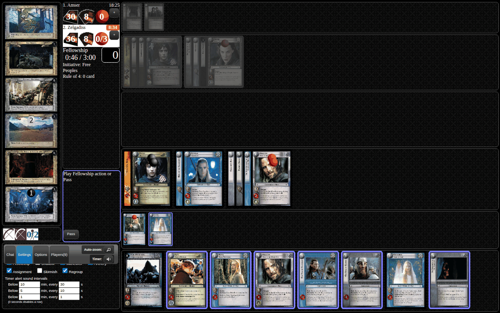
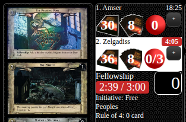
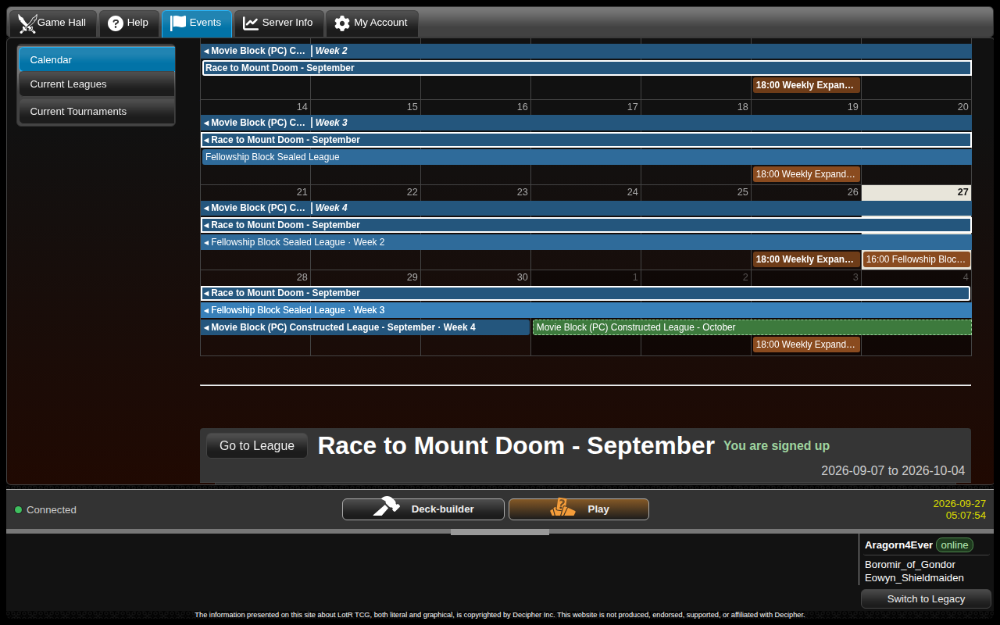
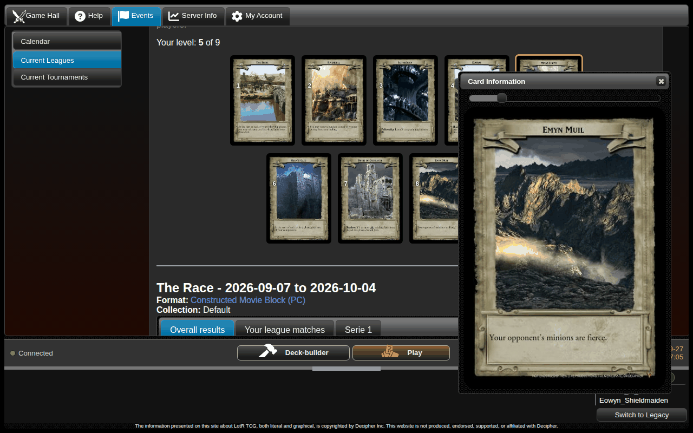

### Timer and Gameplay UX Updates
- **Timer alerts.** Your game clock turns orange under 10 minutes and red under 5. It pulses at each minute mark and plays a sound as time runs low. You can choose how often in the game window's **Settings** tab, or mute the sounds from the tab bar. By default it sounds every 30 seconds under 10 minutes, every 10 seconds under 5 minutes, and every second in the last minute.
- The decision timer now shows time used out of the limit, changes colour, and warns you at 60, 30 and 10 seconds left.
- New setting: **Auto-dismiss deck reveal when searching your own deck** skips the full-deck view and goes straight to your choice. Reveals of your opponent's deck always show.
- The in-game chat box has been rearranged and always keeps a usable minimum height.

 

### Events
- **New Calendar.** The Events tab now opens on a month calendar of current leagues and scheduled tournaments. Click an event to see its dates, description and series, then use **Go to** to open it. Events you have joined are shown in bold. All dates are server time (UTC).
- Leagues can now repeat on a schedule, rotating through a list of formats, so the next league appears without an admin creating it.
- League prizes can now be given for final placement and for taking part.
- A prize card that isn't on Gemp yet can be promised as a **Future Prize**. It shows in your collection and is swapped for the real card automatically once that card is added. It can't be put in a deck.
- League descriptions now support Markdown formatting and links.

### Race to Mount Doom Updates
- **30 new modifiers** (set 94), taken from suggestions by the community. The full list is below.
- Every modifier's intensity rating was re-tuned after further analysis, using the results of the community vote.
- Random races no longer keep choosing the same few modifiers when several have the same intensity.
- RTMD leagues can now run on a repeating schedule. Each new league rolls a new random race.
- Fixed games crashing at seating when a late or duplicated bid answer arrived during the *Go first / Go second* choice. The stray answer is now rejected instead of cancelling the game. ([#1023](https://github.com/PlayersCouncil/gemp-lotr/issues/1023))
- If one modifier makes cards unique and another makes them not unique, the "unique" modifier now takes priority.

The 30 new modifiers

- **94_1:** Maneuver: Exert your ally to allow them to participate in archery fire and skirmishes. At the start of the regroup phase, kill that ally.
- **94_2:** Each time your character is placed in the dead pile (except the Ring-bearer), discard it.
- **94_3:** You may include items, conditions, allies, and followers in your starting fellowship. You cannot play more than 1 card with 0 twilight cost of each card type this way.
- **94_4:** Each time your companion is killed, you may transfer each possession attached to that companion to another eligible bearer.
- **94_5:** If your opponent is the Dark Lord or a World Champion, or if they are placed in the top 10% of the current league, they cannot choose to move during the regroup phase in region 3.
- **94_6:** Site 8 is a sanctuary.
- **94_7:** You may remove burdens instead of wounds during Sanctuary healing.
- **94_8:** Maneuver: If the fellowship is in region 2, place your unique companion with 4 or more vitality (except the Ring-bearer) in the dead pile to skip to the regroup phase.
- **94_9:** Regroup: Discard your minion of twilight cost 5 or more to add a burden.
- **94_10:** Skirmish: Make your minion damage -X until the regroup phase to make another minion strength +X until the regroup phase.
- **94_11:** At the start of the assignment phase, the Shadow player may make a minion gain lurker until the regroup phase.
- **94_12:** Shadow: Discard a minion from hand to take a minion into hand from the discard pile.
- **94_13:** Archery: Make each of your archers strength +3 until the regroup phase. Your archers do not contribute to your archery total and you cannot make any more Archery actions.
- **94_14:** Shadow: Remove 3 threats to add a burden.
- **94_16:** Minions are not unique.
- **94_17:** At the end of each of your turns, choose an opponent who may take control of a site.
- **94_18:** Each companion is resistance -1 for each threat.
- **94_19:** At the start of each archery phase, exert one of your companions.
- **94_20:** Your Ring-bearer may not be exerted by Free Peoples cards.
- **94_21:** Your Free Peoples conditions are unique.
- **94_22:** Your deck must have at least 100 cards.
- **94_23:** The site number of each of your minions is +1. The site number of each of your opponent's minions is -1.
- **94_24:** Your companions are twilight cost +X, where X is the region number (including during your starting fellowship).
- **94_25:** Each time your fellowship moves during the regroup phase in region 3, add 5 threats.
- **94_26:** At the start of the assignment phase, your opponent may assign a minion to skirmish the Ring-bearer. You may add a burden to prevent this.
- **94_27:** Each of your cards is unique.
- **94_28:** Each time you are about to draw a card (except when reconciling), instead your opponent looks at the 2 top cards from your draw deck, chooses 1 for you to take into hand, and the other is placed beneath your draw deck.
- **94_29:** Your opponent's minions are fierce.
- **94_30:** You may not play or take into hand cards from your discard pile or draw deck (except when reconciling).
- **94_31:** Your fellowship cannot win the game until surviving site 10. When moving from site 9, the Shadow player chooses any site 9 from outside the game to play as the next site and adds (4).

### New cards and promos
- The full-art **Hobbit Party Guest** (1C297) promo from the 2026 World Championship circuit has been added. It can be found in the *(S)PC Promo Art Selection* and *Random PC Full Art* packs.
- Deck builder: the Product filter has two new options. **Special** shows promos and other alternate printings, and **Special in Deck** shows only the alternate printings of cards in your current deck. ([#1065](https://github.com/PlayersCouncil/gemp-lotr/pull/1065))

### Card fixes
- **[[Above the Battlement]]** (7C262): can no longer "remove a burden" when there are no burdens to play an Orc for free. The same fix applies to every card that removes a burden as a cost.
- **[[Alatar Deceived]]** (13R78), **[[Pallando Deceived]]** (13U79) and **[[Radagast Deceived]]** (13R80): no longer apply their bonus twice when two Wizards win the same skirmish. ([#1062](https://github.com/PlayersCouncil/gemp-lotr/issues/1062))
- **[[Fearless Approach]]** (13C164): its last sentence was missing. You can now discard a condition when the Free Peoples player plays the fellowship's next site. ([#1005](https://github.com/PlayersCouncil/gemp-lotr/issues/1005))
- **[[Secret Folk]]** (4U34): now also triggers when an ally loses a skirmish, not only a companion. ([#1088](https://github.com/PlayersCouncil/gemp-lotr/issues/1088))
- **[[Rivendell Waterfall]]** (1U342): now raises the move limit when your opponent played the site, which is the usual case. ([#1058](https://github.com/PlayersCouncil/gemp-lotr/issues/1058))
- **[[Silinde, Elf of Mirkwood]]** (1U60): her copy of Rivendell Waterfall now works only while the fellowship is at a Rivendell Waterfall, and it stacks with the site's own bonus. ([#1045](https://github.com/PlayersCouncil/gemp-lotr/issues/1045))
- **[[Away on the Wind]]** (13U60): is now offered. Before, it looked for a card that was both Boromir and Denethor. ([#1078](https://github.com/PlayersCouncil/gemp-lotr/issues/1078))
- **[[Uruviel, Maid of Lórien]]** (1C67): now drops the old site's game text when your site 6 is replaced. ([#1054](https://github.com/PlayersCouncil/gemp-lotr/issues/1054))
- **[[Fell Voices Call]]** (V1U37): can no longer be played at The Great River when neither option can play a card. ([#1080](https://github.com/PlayersCouncil/gemp-lotr/issues/1080))
- **[[Saruman, Fell Voice]]** (V1R30): now boosts Isengard minions only while the fellowship's current site bears a weather, not a weather anywhere. ([#1070](https://github.com/PlayersCouncil/gemp-lotr/issues/1070))
- **[[Grown Suddenly Tall]]** (4R92, PC errata): now plays in the regroup phase as written, and the twilight it adds is capped at 5. ([#1059](https://github.com/PlayersCouncil/gemp-lotr/issues/1059))
- **[[Blood Runs Chill]]** (8R3): fixed, in both the original and the PC errata. ([#1026](https://github.com/PlayersCouncil/gemp-lotr/issues/1026), [#1056](https://github.com/PlayersCouncil/gemp-lotr/issues/1056))
- **[[Swarthy Bree-lander]]** (11C101): no longer crashes the game when [[Lost in the Woods]] is chosen for transfer. Conditions with no eligible bearer can't be chosen. ([#1025](https://github.com/PlayersCouncil/gemp-lotr/issues/1025))
- **[[Lorien Throne Room]]** (V1U61): when several companions exert at once, each trigger now names the companion it would heal. ([#1079](https://github.com/PlayersCouncil/gemp-lotr/issues/1079))
- **[[Endless Night]]** (V3_96): can now play Sauron when he only becomes affordable after hindering, and no longer counts itself as a card to hinder. ([#1014](https://github.com/PlayersCouncil/gemp-lotr/issues/1014))
- **[[Still They Came]]** (4C175): the +3 strength now has to go to a different Uruk-hai from the one you exerted. ([#1067](https://github.com/PlayersCouncil/gemp-lotr/pull/1067))
- **[[Banner of Elbereth]]** (6U14): its two options on winning a skirmish are now labelled *Draw a card* and *Discard to liberate a site*. ([#1066](https://github.com/PlayersCouncil/gemp-lotr/pull/1066))

### Other fixes
- One slow game no longer freezes every other table on the server.
- Anyone who joins or refreshes a finished game now sees that it is over, instead of the decision that was pending when it ended.
- King Block solo draft: the pack contents are updated. ([#1064](https://github.com/PlayersCouncil/gemp-lotr/pull/1064))
- Admins: league creation is rebuilt, with a prize-tier editor and editing of running leagues. There is also a new script for adding promos, and slow game actions are now logged.
