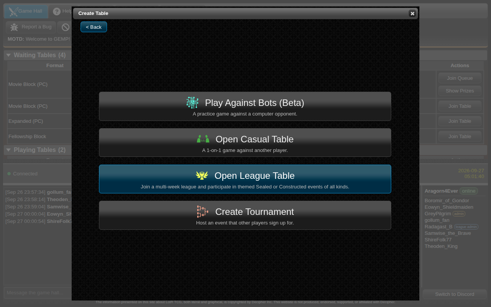
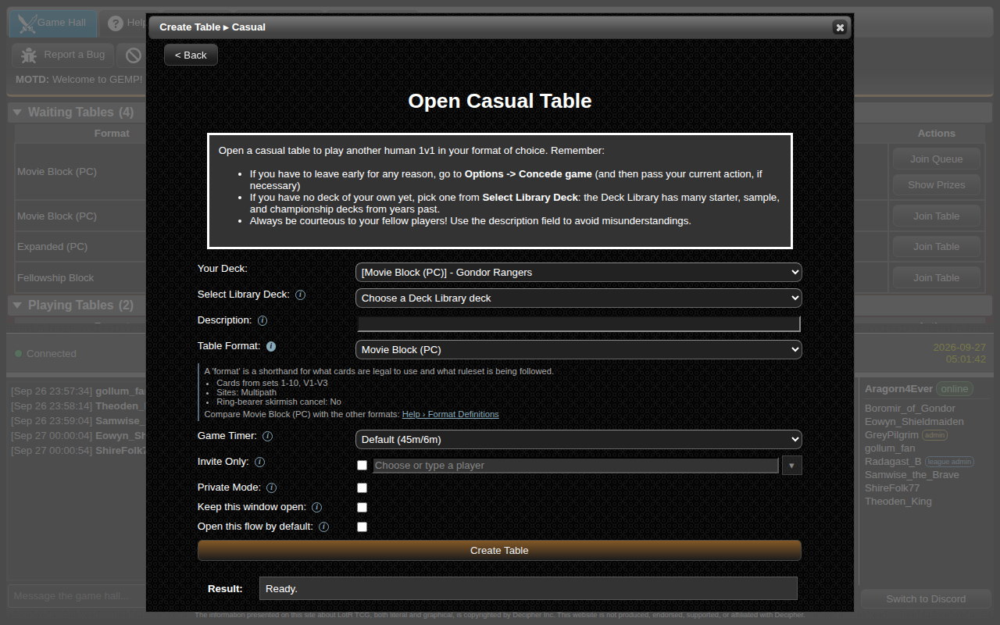
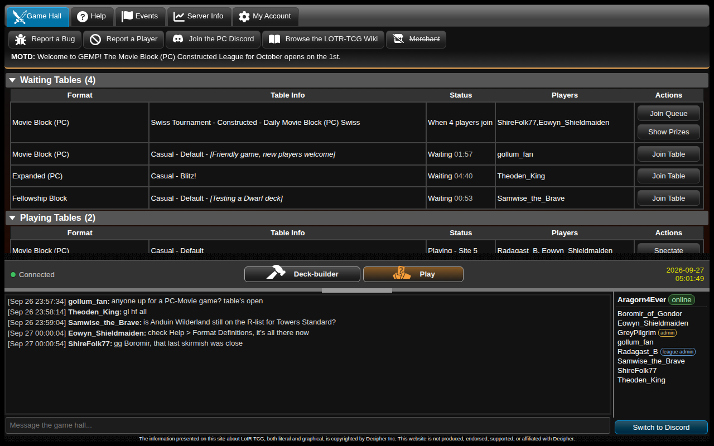
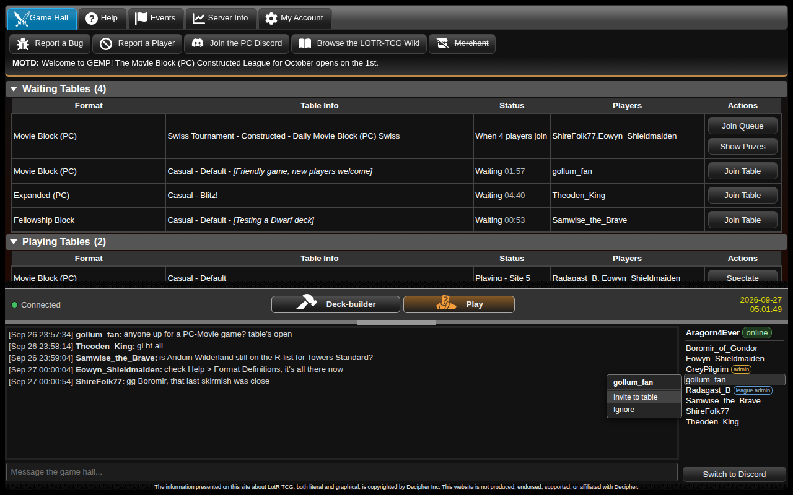
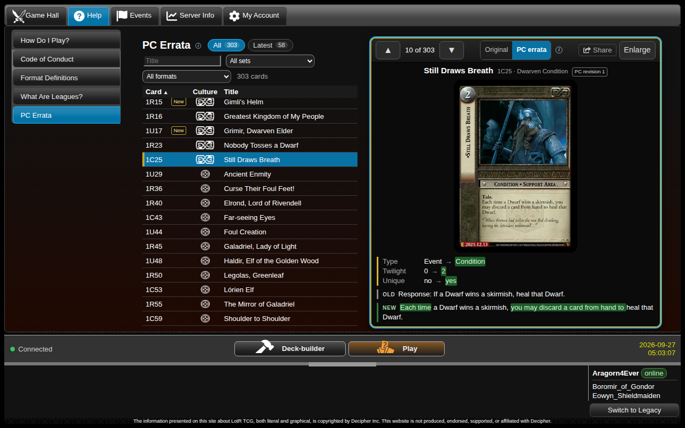
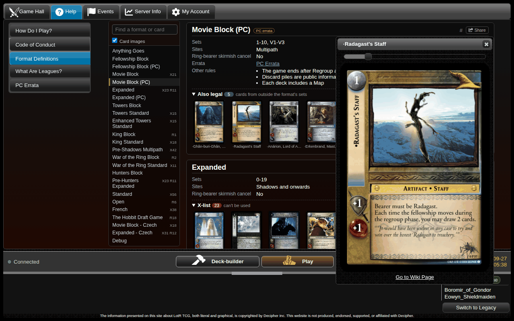
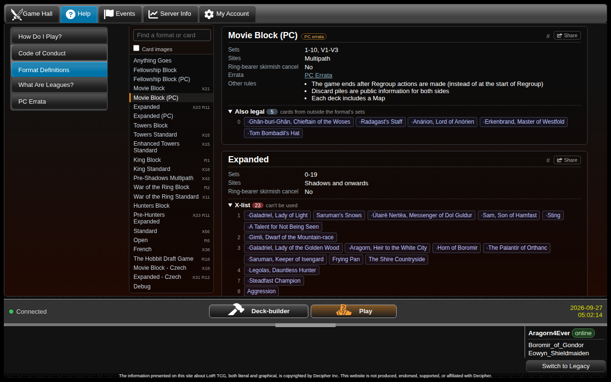
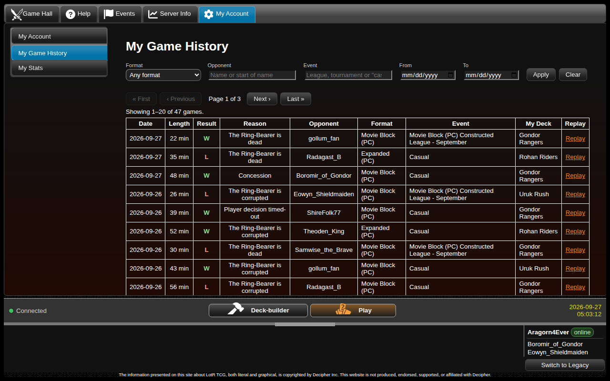
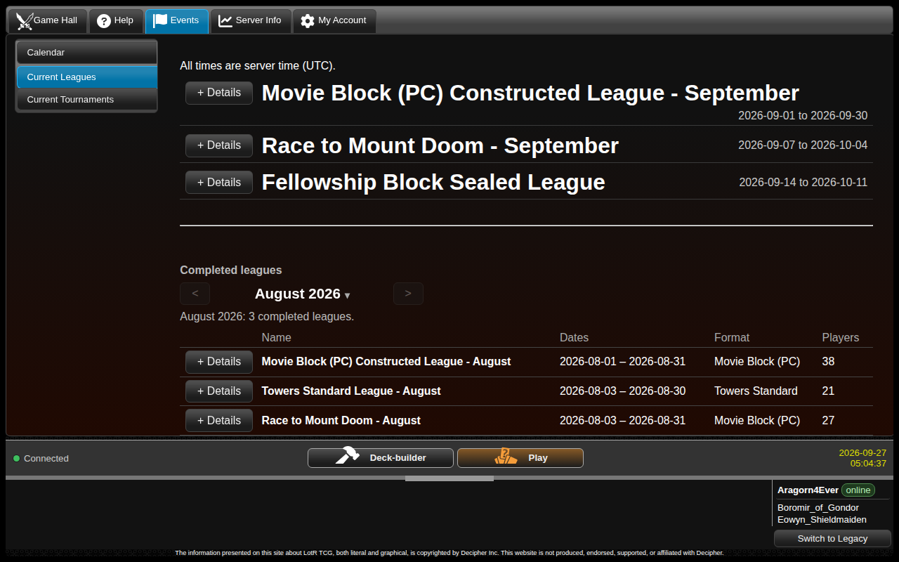

### Table Creation
- **Deck Library for everyone.** Every Play and Join screen now has a *Select Library Deck* list of starter, sample and past championship decks, so you can play without building a deck first (or easily find a starter when teaching new players).
- The table-type screen now explains each option, and "Unranked" tables are now called **Casual**. Unfamiliar terms have an ⓘ with a short explanation.
- Invite-only tables have a proper player picker, and only the invited player can join.
- If your browser blocks the game window, a **Your game is ready** button appears instead of the game silently failing to open.

 

### The Game Hall
- A **Connected / Reconnecting / Disconnected** readout sits at the bottom left. The hall now retries on its own instead of quietly freezing.
- Waiting tables show how long they have been open.
- Tabs remember where you were and refresh when you come back to them, so these screens won't wipe away your selections so often.
- Most controls throughout the game hall have been overhauled to be keyboard-navigation-friendly, so get your Tab keys ready!

 

### Players and Chat
- The player list in the hall has been overhauled, and all previously /slash commands have been integrated into the UI properly.
- Click the Online icon next to your own name to switch to Incognito mode, or vice versa
- Click a name in the player list to invite that player to a table or ignore them. 
- My Account now has a form for you to search for and ignore other players, as well as view the list of players you have ignored.
- The chat panel's resize handle no longer sticks over the Discord chat, and the legacy chat's typing box is a usable size again.  This should be a long-standing bug finally fixed.

### Help and Server Info
- **Help > Format Definitions** is rebuilt: pick a format on the left to see its sets, sites and rules, with the X- and R-lists grouped by set.
- **Help > PC Errata** is now a browsable table. Step through every erratum with the arrow keys or the mouse wheel to see the card, what changed and the old and new text.
  - Click on a card to flip it back and forth between old and new.
  - A new readout gives both old and new text with colored highlighting to make it easier to compare what changed.
  - Scroll, swipe, or use arrow keys on the right pane to navigate through cards one at a time.  Scroll or swipe on the left pane to skip ahead quickly in the list.
- **Server Info > Patch Notes** (this page) replaces the old change log. Filter the updates by tag, jump to any month, and read past announcements here too. Each new update is also announced in the hall for two weeks.
- **Server Info > Server Stats** now shows how many games were played against bots. The per-format tables count only games between players.
- **Share links.** Every update here, every erratum and every format has a **Share** button that copies a link. Pasted into Discord or a forum, the link shows a preview with a title, a short description and a picture. Anyone who opens it goes straight to that page, without logging in.
- Formats, errata, patch notes and help pages can also be linked directly, for example [Movie Block (PC)](#format-pc_movie) or [Cleaving Blow](#errata-1_5).

  

### My Account and Events
- **My Game History** now pages through all your games and can be filtered by format, opponent, event and date. New columns show the length of each game and how it ended.
- You can manage your ignored players from My Account.
- The **Events > Calendar** tab now shows the full league or event details when you select an item, letting you join that event directly or view standings on that same screen.
- **Events > Current Leagues** and **Events > Current Tournaments** have both been overhauled to have a more streamlined presentation.  Each individual event now has its own details pane instead of sharing the same pane at the top.
- Both leagues and tournaments now show past events on the bottom of the screen, permitting anyone to browse through old standings or details.

 

### Card and rules fixes
- **[[Morgul Regiment]]** (7R197), **[[Morgul Spawn]]** (7C200) and **[[Morgul Spearman]]** (7C201): exerting to assign one of them no longer lets you assign all of them. ([#1090](https://github.com/PlayersCouncil/gemp-lotr/issues/1090))
- **[[Rivendell Waterfall]]** (1U342): no longer raises the move limit more than once per turn. The same fix applies to other once-per-turn effects, such as [[Bree Gate]], [[Horse-country]], [[Derndingle]], [[Steps of Edoras]] and [[Traitor's Voice]]. ([#1091](https://github.com/PlayersCouncil/gemp-lotr/issues/1091))
- Reverting the erroneous fix to [[Helpless]]; it no longer protects Sam from losing Ring-bound, meaning [[Aragorn, Wingfoot]] will once again count a Helpless Sam as an unbound hobbit.
- **RTMD:** the Mount Doom modifier [[93_4]] now wounds your characters in either role, not only when you are the Free Peoples player. ([#1099](https://github.com/PlayersCouncil/gemp-lotr/issues/1099))
- **RTMD:** the newest modifiers now show their card art and no longer display "null". ([#1094](https://github.com/PlayersCouncil/gemp-lotr/issues/1094), [#1096](https://github.com/PlayersCouncil/gemp-lotr/issues/1096))
- **RTMD:** a revealed hand can now be viewed by spectators and by its owner. ([#1095](https://github.com/PlayersCouncil/gemp-lotr/issues/1095))
- **Bots:** no longer lose with "Invalid decision" when **[[Uruk Guard]]** limits who they can assign it to. ([#1097](https://github.com/PlayersCouncil/gemp-lotr/issues/1097))

### Other fixes
- Temporary bans now take effect. Previously a temp-banned player could still log in, and bans of 25 days or longer ended at once.
- The "Join Tournament" button for joining a tournament late works again.
- Admins: the prize screen can load every player from a recent league or tournament into its player list, in standings order.
